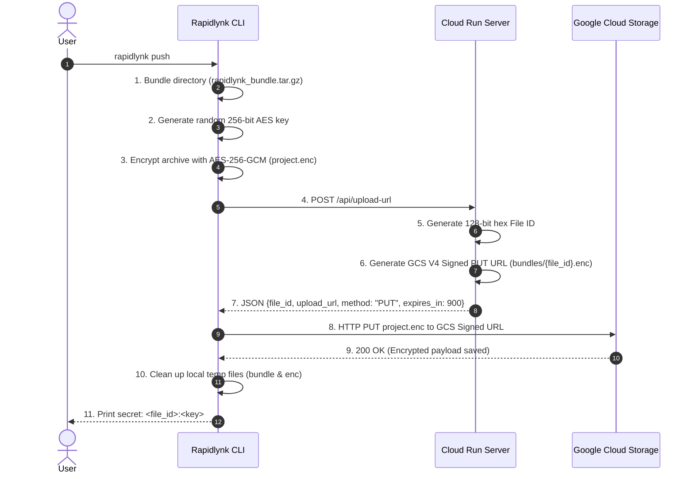
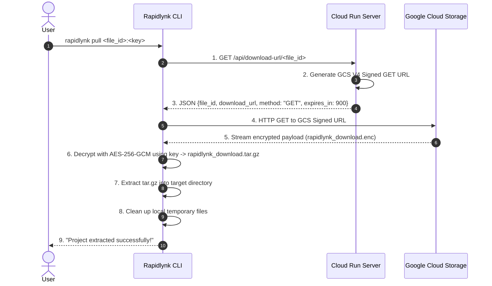

# Rapidlynk — Architecture Documentation

## Overview

Rapidlynk is a high-performance, secure CLI and server platform for instant, encrypted project bundling and sharing powered by **Google Cloud Run** and **Google Cloud Storage (GCS)**.

- **Client-Side Encryption**: Projects are bundled (`tar.gz`) and encrypted with **AES-256-GCM** on the user's machine before transmission. The server and storage never have access to the raw project or encryption key.
- **Direct Cloud Storage Uploads**: Cloud Run generates time-limited V4 Pre-Signed URLs, allowing the CLI to stream encrypted payloads (`project.enc`) directly to Google Cloud Storage (HTTP `PUT`). This minimizes Cloud Run bandwidth and eliminates memory bottlenecks.
- **Zero-Knowledge Architecture**: The CLI generates a unique 256-bit AES key and displays `<file_id>:<key>`. To pull a project, recipients query Cloud Run for a signed download URL, download directly from GCS, and decrypt locally.

```
rapidlynk push
      │
      ▼
Bundle project (tar.gz)
      │
      ▼
Encrypt with AES-256-GCM (project.enc)
      │
      ▼
Ask Cloud Run for upload URL (POST /api/upload-url)
      │
      ▼
Cloud Run generates:
  • File ID
  • GCS Signed Upload URL (PUT)
      │
      ▼
CLI receives URL
      │
      ▼
CLI automatically uploads project.enc
      │
      ▼
Google Cloud Storage
      │
      ▼
CLI displays secret (<file_id>:<key>)
```

---

## Directory Map

```
go_cli/
├── cli/                    # Rapidlynk Go CLI
│   ├── main.go             # CLI entrypoint and commands (push, pull, version)
│   ├── push.go             # Push flow: bundle -> encrypt -> ask URL -> upload GCS -> secret
│   ├── pull.go             # Pull flow: ask URL -> download GCS -> decrypt -> extract
│   ├── archive.go          # Pure Go tar.gz creator & extractor
│   ├── crypto.go           # AES-256-GCM encryption & decryption
│   └── http.go             # HTTP client for Cloud Run & GCS Signed URLs
├── server/                 # Cloud Run Server
│   ├── main.go             # Server entrypoint and graceful startup
│   ├── routes.go           # HTTP route setup
│   ├── config/
│   │   └── config.go       # Environment configuration (GCS_BUCKET, SA, PORT, TTL)
│   ├── handlers/
│   │   ├── upload_url.go   # POST /api/upload-url (generates File ID & GCS Signed PUT URL)
│   │   ├── download_url.go # GET /api/download-url/{id} (generates GCS Signed GET URL)
│   │   └── health.go       # GET /health & GET / (Cloud Run probes)
│   ├── storage/
│   │   ├── provider.go     # Storage Provider interface
│   │   └── gcs.go          # Google Cloud Storage V4 IAM SignBlob integration
│   └── utils/
│       └── id.go           # Cryptographic 128-bit hex ID generator
├── Dockerfile              # Multi-stage Dockerfile for Cloud Run deployment
├── .dockerignore           # Container build exclusions
├── go.mod / go.sum         # Dependencies including cloud.google.com/go/storage
├── README.md               # User & operator guide
└── LICENSE                 # MIT License
```

---

## Sequence Diagrams

### 1. Push Flow (`rapidlynk push`)



### 2. Pull Flow (`rapidlynk pull <file_id>:<key>`)



---

## Cryptography Specifications

- **Cipher**: AES-256-GCM (Galois/Counter Mode).
- **Key Generation**: 32 cryptographically random bytes (`crypto/rand`).
- **Key Encoding**: Base64 URL-safe string.
- **Payload Format**: `[12-byte Nonce][Ciphertext + 16-byte GCM Authentication Tag]`.
- **Integrity**: Any tampering with the ciphertext causes AES-GCM verification failure during decryption before extraction.

---

## Server Configuration

| Environment Variable | Default | Description |
|---|---|---|
| `PORT` | `8080` | Port listened on by Cloud Run |
| `GCS_BUCKET` | `rapidlynk-storage` | Target Google Cloud Storage bucket |
| `GCS_SERVICE_ACCOUNT` | `rapidlynk-sa@rapidlynk-504704.iam.gserviceaccount.com` | Service account used for V4 IAM Blob Signing |
| `URL_EXPIRATION_MINUTES`| `15` | Expiration time for signed upload/download URLs |
| `GOOGLE_APPLICATION_CREDENTIALS` | *(Optional)* | Path to local credentials if running outside Cloud Run |
