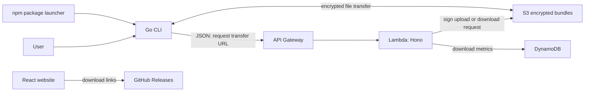

# Rapidlynk project, deployment, and update guide

Initial source analysis date: 2026-10-08. Checkout: `59ae3eff7c10a3e6f04acccc8a3365058d20783e` plus the existing local README edit. This guide describes the source. A subsequent read-only AWS inspection is recorded in [PRODUCTION.md](PRODUCTION.md): production has two-day S3 expiration and a separate S3-triggered upload-metrics Lambda. npm, GitHub release assets, and website hosting settings have not been inspected.

## What the project does

Rapidlynk shares the current directory as an encrypted snapshot. The Go CLI bundles files, encrypts locally, asks an AWS API for permission to transfer, and uploads directly to S3. Recipients use a secret containing the object ID and encryption key to download, decrypt, and extract that snapshot.

There are three independently released components:

| Component | Source | Runtime or distribution |
| --- | --- | --- |
| CLI | `cli/` | Native Go binaries; npm wrapper; Windows installer |
| Backend | `server/src/` | TypeScript/Hono handler for AWS Lambda behind API Gateway |
| Website | `web/` | React + Vite + Tailwind static site; docs mention Vercel |



## Source index and reading order

| File or directory | Responsibility |
| --- | --- |
| `cli/main.go` | Commands: push, pull, help, version. Current version: 1.0.1. |
| `cli/push.go` | Archive -> encrypt -> request upload URL -> S3 multipart POST -> print secret. |
| `cli/pull.go` | Parse secret -> request download URL -> download -> decrypt -> extract into current directory. |
| `cli/archive.go` | tar.gz creation and extraction, fixed exclusions, extraction path check. |
| `cli/crypto.go` | AES-256-GCM, random key and nonce, URL-safe Base64 key encoding. |
| `cli/http.go` | API contracts, default API endpoint, environment override, S3 HTTP transfers. |
| `cli/archive_test.go`, `cli/crypto_test.go` | Existing archive and encryption tests; not executed for this analysis. |
| `server/src/lambda.ts` | Exports `handler = handle(app)` using Hono's AWS Lambda adapter. |
| `server/src/dev.ts` | Local HTTP server on port 3000. |
| `server/src/app.ts` | Health, S3 diagnostic, upload and download URL routes. |
| `server/src/services/s3.ts` | S3 presigned POST/GET, object size lookup, bucket diagnostic. |
| `server/src/services/dynamodb.ts` | Monthly download/upload metrics helpers. |
| `server/package.json` | Local dev, TypeScript build, esbuild Lambda bundle. |
| `web/src/main.tsx` | Mounts React and BrowserRouter. |
| `web/src/App.tsx` | Active routes: `/`, `/download`, `/learn`, `/about`, `/contribute`; fallback redirects to `/`. |
| `web/src/layouts/SiteLayout.tsx` | Shared header, page content, footer. |
| `web/src/pages/` | Landing page, downloads, learning material, about, contribution; Docs/Blog files exist but routes are commented out. |
| `web/src/components/` | Shared buttons, cards, tables, terminal demos, navigation and page heroes. |
| `web/src/content/siteContent.ts` | Static content collections. |
| `web/src/styles/index.css`, Tailwind/PostCSS configuration | Website styling. |
| `scripts/build-all.ps1`, `scripts/build-all.sh` | Cross-compile six CLI binaries into `dist/`, copy into `npm/vendor/`. |
| `npm/package.json`, `npm/bin/rapidlynk.js` | Active npm package, version 1.0.1; selects a native binary by OS/CPU and runs it. |
| `scripts/build-installer.ps1`, `installer/rapidlynk.iss` | Windows x64 Inno Setup installer; adds/removes user PATH entry. |
| `PUBLISHING.md`, `WEB_RELEASES.md` | Existing CLI/npm/GitHub release instructions, with discrepancies listed below. |
| `ARCHITECTURE.md`, `Dockerfile` | Historical Go/Google Cloud backend description and build recipe. |
| `rapidlynk-npm/` | Deprecated distribution, version 0.4.2; do not use for future publishing. |

## Push and pull in detail

**Push:** `rapidlynk push` walks the current directory and creates `rapidlynk_bundle.tar.gz`. It skips `.git`, a fixed list of Rapidlynk temporary/executable names, and files ending in `.tar.gz` or `.enc`. It does not honor `.gitignore`; `.env` and `node_modules` are not excluded by this implementation.

Encryption creates a fresh 32-byte key and GCM nonce. Stored payload is nonce followed by authenticated ciphertext. Encryption reads the entire archive into memory. The HTTP upload also buffers the multipart body in memory.

The CLI sends `POST /api/upload-url` with `{filename: "project.enc", size: <encrypted byte count>}`. The backend validates a positive size up to `500 * 1024 * 1024` bytes, generates a random 16-byte hex ID, and signs an S3 POST for `bundles/<id>`. It returns `{message, url, fileId, fields}`. The CLI sends those fields and the encrypted file directly to S3, then prints `<fileId>:<base64url-key>`. Successful intermediate files are removed by deferred cleanup.

**Pull:** `rapidlynk pull <id>:<key>` sends `GET /api/download-url/<id>`; the key stays on the recipient's machine. The backend obtains the S3 object size, updates monthly DynamoDB download metrics, and returns `{message, url}` containing a presigned GET URL. The CLI downloads `rapidlynk_download.enc`, decrypts to `rapidlynk_download.tar.gz`, and extracts into the current directory. Existing files at matching paths are truncated and replaced.

Presigned URLs expire after 900 seconds. That is an access URL expiry, not deletion of the stored object. No object retention, one-use secret enforcement, or delete-after-download implementation is present in this checkout.

## Backend contract and configuration

| Setting | Checked-in default |
| --- | --- |
| CLI API origin | `https://plit6sl6b8.execute-api.ap-south-1.amazonaws.com` |
| CLI override | `RAPIDLYNK_SERVER`; trailing slashes removed |
| AWS SDK region | `AWS_REGION` or `ap-south-1` |
| S3 bucket | `S3_BUCKET` or `rapidlynk-storage-prod` |
| DynamoDB table | `DYNAMODB_TABLE` or `rapidlynk-metrics` |
| DynamoDB key | String partition key `month`, formatted `YYYY-MM` in UTC |
| Local backend port | 3000, hardcoded in `server/src/dev.ts` |
| Transfer URL validity | 900 seconds |
| Maximum encrypted object size | 524,288,000 bytes (500 MiB) |
| CLI HTTP timeout | Five minutes |

AWS credentials are resolved by the AWS SDK; no explicit credential wiring is in the services. Lambda needs an execution role permitting the relevant S3 operations and DynamoDB updates. Bucket policies, execution role, API Gateway configuration, throttling, Lambda function name, aliases, deployed runtime, and lifecycle rules are not defined here.

`GET /health` returns a static health message. `GET /test-s3` checks the hardcoded production bucket even if `S3_BUCKET` points elsewhere. Download metrics count URL issuance, not a confirmed completed transfer. Metrics failures prevent returning the download URL. `recordUpload` exists and is imported but is never called by the upload route.

## How backend deployment works

The original checkout provided only a build step. The subsequent deployment documentation adds a SAM template and PowerShell deployment script for a new environment; see [DEPLOYMENT.md](DEPLOYMENT.md). No GitHub Actions workflow automatically publishes the backend on push.

From `server/`, the available commands are:

```powershell
npm ci
npm run dev
npm run build:lambda
```

At the time of the initial analysis, `build:lambda` emitted `server/dist/lambda.js` without an explicit format. The deployment tooling now emits `server/dist/lambda/index.cjs` in CommonJS format, with handler `index.handler`. See [DEPLOYMENT.md](DEPLOYMENT.md) and `infrastructure/template.yaml` for the new-environment SAM workflow. The existing production configuration is still unverified.

The explicit `.cjs` artifact avoids ambiguity from the package's `"type": "module"`. AWS documents [module formats and handler naming](https://docs.aws.amazon.com/lambda/latest/dg/nodejs-handler.html) and [ZIP packaging](https://docs.aws.amazon.com/lambda/latest/dg/nodejs-package.html).

Backend-only updates reach existing CLI installations as soon as the backend serving their configured API endpoint changes, provided its request/response contract stays compatible. If the default API origin changes, old binaries continue using the old origin until users upgrade or set `RAPIDLYNK_SERVER`.

Keep upload JSON fields `url`, `fileId`, and `fields`, download field `url`, route methods, S3 key layout, and stored payload format compatible with existing releases. Changing `bundles/<id>` or moving buckets needs a way to retrieve old objects if existing secrets must keep working.

## How CLI releases and updates work

1. Change `const version` in `cli/main.go` and `version` in `npm/package.json` together.
2. Run `scripts/build-all.ps1` from the repository root on Windows, or `scripts/build-all.sh` on Unix. These build Windows/Linux/macOS for amd64 and arm64.
3. For npm, the result must include all six correctly named binaries under `npm/vendor/`. Publish from `npm/`, which is the active distribution.
4. For the Windows installer, run `scripts/build-installer.ps1 -BuildBinary`. It reads the version from `cli/main.go`, compiles x64, and passes that version to Inno Setup. Output: `installer/Output/Rapidlynk-Setup-<version>-x64.exe`.
5. Publish a GitHub release with the installer and the platform binaries needed by the site's links.
6. Update website version text when releasing; it is hardcoded in several components.

Neither build-all script uses its version variable to modify or stamp the binary. Its version parameter/default does not change `rapidlynk --version`; the Go constant determines that output. The installer script overrides the older default in `.iss` automatically.

The npm launcher maps `win32/x64` -> `rapidlynk-windows-amd64.exe`, `win32/arm64` -> `rapidlynk-windows-arm64.exe`, and equivalent Linux/Darwin names. It runs the packaged binary with the user's arguments and inherited stdio. Its postinstall attempts to set Unix execute permissions. It does not fetch release assets or check for updates.

Existing npm users explicitly install a newer version, for example `npm install -g rapidlynk@latest`. Installer users download and run the newer installer. Standalone binary users replace their executable. The CLI implements no `update` command or background updater. `npx rapidlynk@latest` expresses the intended latest npm package selection.

## GitHub download links and a release-doc error

The website downloads assets from:

```text
https://github.com/Galactic-git/rapidlynk/releases/latest/download/<asset-name>
```

The linked asset names are:

```text
RapidLynk-Setup-latest-x64.exe
rapidlynk-windows-amd64.exe
rapidlynk-darwin-arm64
rapidlynk-darwin-amd64
rapidlynk-linux-amd64
rapidlynk-linux-arm64
```

Every release designated latest needs these exact asset names for all those links to work. The Windows arm64 binary is built for npm but has no corresponding direct link on the Download page.

`WEB_RELEASES.md` says attaching `versioned-file.exe#RapidLynk-Setup-latest-x64.exe` renames the asset. This is incorrect: `#...` specifies a display label. The [GitHub CLI manual](https://cli.github.com/manual/gh_release_upload) documents that distinction. Copy the installer to a file actually named `RapidLynk-Setup-latest-x64.exe` before attaching it. Example preparation for a future 1.0.2 release:

```powershell
Copy-Item -LiteralPath "installer\Output\Rapidlynk-Setup-1.0.2-x64.exe" -Destination "dist\RapidLynk-Setup-latest-x64.exe"
```

Upload that actual filename and the platform binaries to the intended release. GitHub documents the [latest asset URL convention](https://docs.github.com/en/repositories/releasing-projects-on-github/linking-to-releases). Updating latest release assets changes future downloads without changing the link in website code. It does not upgrade binaries already installed, or update the site's displayed version text.

## How website deployment and updates work

`web/` is a static React site. `npm run build` runs `tsc -b && vite build`; output is `web/dist`. `npm run dev` starts Vite. No fetch/axios transfer client is implemented in the inspected website: its interactive landing page generates/copies CLI commands, and downloads link to GitHub. It does not upload or decrypt projects in the browser.

Existing release docs refer to Vercel, and `.gitignore` also mentions Netlify, but no checked-in provider project settings or deployment workflow establish the live host or auto-deploy behavior. For a host configured around this app, the project root would normally be `web`, build command `npm run build`, and output directory `dist`. BrowserRouter deep links require the host to serve `index.html` for app routes.

If the live host has Git integration, a push to its configured production branch may redeploy the site; that connection must be checked in the hosting dashboard. Changing TypeScript source requires rebuilding and deploying. Changing a GitHub latest release asset only changes the downloaded file; no website rebuild is needed for the unchanged URL. Local copies in `web/public/downloads/` are not used by the inspected main download links; if served directly, they must be replaced and the site redeployed separately.

## What each future change requires

| Change | Release action | Effect on existing installations |
| --- | --- | --- |
| Backend logic with same API contract | Build/package/deploy Lambda | Used on next API request |
| S3/IAM/retention/API configuration | Update AWS resources | Can affect all clients immediately |
| CLI logic or encryption/archive format | Rebuild binaries; publish npm and GitHub/installer | Users must upgrade; preserve old payload support if necessary |
| npm wrapper | Publish a new npm package with staged binaries | npm installations update explicitly |
| New Windows installer | Publish actual stable asset filename in latest release | Future downloads change; installed users rerun setup |
| Website layout/content/version text | Rebuild and deploy `web/` | Visitors see deployed changes |
| New features advertised on website | Implement CLI/backend support and release; then publish accurate docs | Site text alone adds no CLI capability |

## Discrepancies and gaps to keep in mind

- `ARCHITECTURE.md` describes removed Go server files and Google Cloud. The Dockerfile runs `go build ./server`, but the current backend is TypeScript; this recipe does not build the checked-out backend.
- CLI help and pull comments still mention Google Cloud/GCS even though HTTP transfer code uses AWS/S3.
- README's pull diagram says POST; source implements GET. README says Go 1.22+, but `go.mod` declares Go 1.25.0.
- Website Home/About/Learn pages advertise channel flags such as `push -c`; the CLI has no flag parser or channel routes. `push -c ...` simply reaches ordinary encrypted push because extra push arguments are ignored. `pull -c ...` attempts to parse `-c` as a secret and fails.
- The phrase one-time secret in website copy is not enforced by the backend. A secret can be reused while its object remains available.
- Backend errors and missing filenames frequently return HTTP 200; clients then encounter missing response fields. Download metrics can block transfers, and upload metrics are not wired into the route.
- The S3 helper logs full presigned download URLs, which are temporary access credentials.
- CLI errors generally print and return instead of setting a failure exit code, so scripts can receive exit status 0 for failed transfers.
- Archive creation includes `.env` and dependency folders unless their names match fixed exclusions. Extraction overwrites files; its raw string prefix traversal check lacks a directory-boundary check and should be hardened before relying on it for untrusted archives.
- Encryption/decryption and multipart upload use whole-file buffers, so large bundles need substantially more memory than their compressed size.
- The new SAM template and deployment guide provide infrastructure definitions and a manual deployment/rollback workflow for a new environment. The existing production setup is still unverified. Git commit, npm publication, GitHub release, Lambda deployment, and website deployment are distinct operations.

## Scope of this analysis

Source, manifests, existing tests, release scripts, docs, and recent Git history were read. No application tests, builds, publication, cloud mutation, or production transfer was performed. The source describes intended AWS behavior; it does not prove the configuration currently deployed in AWS or the versions currently available on npm/GitHub. Graph generation is subject to the understand skill's separate exclusion-confirmation step.
