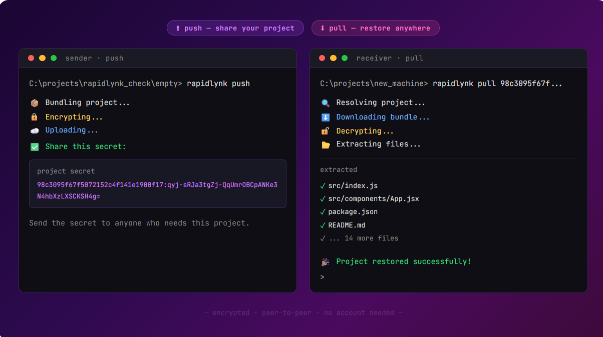

# Rapidlynk



Rapidlynk is a Go-based project bundling and sharing tool. It consists of a Command Line Interface (CLI) and a backend server, allowing users to easily bundle their project files, upload them to a server, and share them via a unique ID. Other users can then use the CLI to pull and extract the project bundle using that ID.b

## Architecture

The project is split into two main components:

- **Server**: A Go HTTP server that handles file uploads and downloads.
- **CLI**: A command-line tool to push (upload) and pull (download) project bundles.

### Directory Structure

```text
rapidlynk/
├── cli/              # Command Line Interface source code
│   ├── archive.go    # Logic for archiving (tar.gz) project files
│   ├── http.go       # HTTP client logic to interact with the server
│   ├── main.go       # CLI entrypoint and command routing
│   ├── pull.go       # Implementation of the 'pull' command
│   └── push.go       # Implementation of the 'push' command
├── server/           # Backend server source code
│   ├── config/       # Server configuration
│   ├── handlers/     # HTTP handlers (upload, download)
│   ├── storage/      # File storage management
│   ├── utils/        # Utility functions
│   ├── main.go       # Server entrypoint (runs on port 8080)
│   └── routes.go     # HTTP route definitions
├── go.mod            # Go module definition (module named go_cli)
└── README.md         # This documentation file
```

## Setup & Usage

### Prerequisites
- [Go](https://golang.org/doc/install) (version 1.22 or higher)

### Running the Server

To start the backend server, navigate to the `server` directory and run the main file:

```bash
cd server
go run main.go routes.go
```
The server will start running on `http://localhost:8080` with endpoints `/upload` and `/download/`.

### Using the CLI

You can run the CLI directly using `go run` or compile it into an executable.

**Commands:**

*   **Push**: Bundles the current project directory into a `tar.gz` archive, uploads it to the server, and provides a unique ID.
    ```bash
    go run ./cli push
    ```

*   **Pull**: Downloads the encrypted project bundle associated with a specific ID and extracts it into the current directory.
    ```bash
    go run ./cli pull <id>:<key>
    ```

## Development

- The module name in `go.mod` is currently `go_cli`.
- The CLI uses standard `tar` commands for extraction, so a Unix-like environment or an environment with `tar` installed is required for the `pull` command to function correctly.

## Channel-based usage (new)

- Push to a named channel:
  ```bash
  go run ./cli push -c <channel>
  ```
- Pull by channel (downloads the latest plain tarball for that channel and extracts it):
  ```bash
  go run ./cli pull -c <channel>
  ```

## Windows installer

- Windows distribution is packaged with Inno Setup from `installer/rapidlynk.iss`.
- The installer places `rapidlynk.exe` in `%LocalAppData%\Programs\Rapidlynk\` and adds that folder to the current user `PATH`.
- The generated installer is written to `installer\Output\`.
