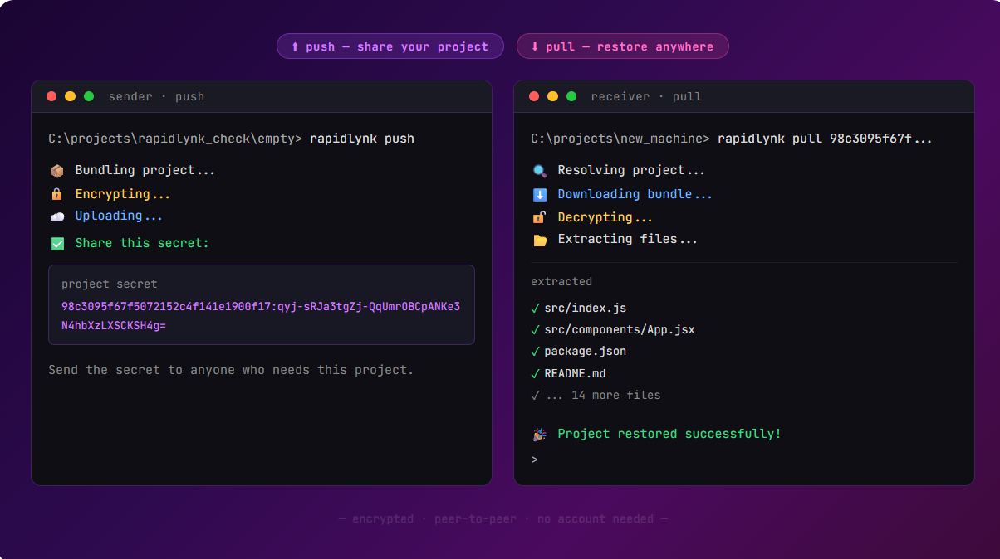

# Rapidlynk



Rapidlynk is a high-performance, zero-knowledge CLI for bundling, encrypting, and sharing project directories securely. Rapidlynk uses **AWS API Gateway, AWS Lambda, and Amazon S3** for the backend. Project files are encrypted locally before they are uploaded, and the actual file transfer happens directly between the CLI and Amazon S3 using short-lived presigned URLs.

---

## How It Works

### Push
```text
rapidlynk push
      │
      ▼
Bundle project (tar.gz)
      │
      ▼
Encrypt locally (AES-256-GCM → project.enc)
      │
      ▼
POST /api/upload-url
      │
      │ { filename, size }
      ▼
API Gateway
      │
      ▼
AWS Lambda
      │
      ▼
Generate S3 Presigned POST
      │
      │ { fileId, url, fields }
      ▼
CLI
      │
      │ multipart/form-data
      ▼
Amazon S3
      │
      ▼
CLI displays secret <file_id>:<encryption_key>
```

### Pull
```text
rapidlynk pull <file_id>:<key>
      │
      ▼
POST /api/download-url/<file_id>
      │
      ▼
API Gateway
      │
      ▼
AWS Lambda
      │
      ▼
Generate S3 Presigned GET URL
      │
      ▼
CLI
      │
      │ Download encrypted file
      ▼
Amazon S3
      │
      ▼
Decrypt locally (AES-256-GCM)
      │
      ▼
Extract project
```

---

## Security Model

Rapidlynk follows a zero-knowledge approach for project contents:

- **Client-Side Encryption**: Projects are encrypted locally on the user's machine using **AES-256-GCM**.
- **No Shared Secrets with Server**: The encryption key is never sent to the backend.
- **Metadata Only**: The backend only handles the encrypted file and file metadata.
- **Encrypted Storage**: File contents are stored in Amazon S3 strictly in encrypted form.
- **Presigned URLs**: S3 upload and download access uses short-lived presigned URLs.

The sharing secret contains the file ID and encryption key:
```text
<file_id>:<encryption_key>
```
Anyone with this secret can retrieve and decrypt the shared project, so it should be treated as sensitive.

---

## How to Use

### Prerequisites
For development/building the CLI:
- [Go](https://golang.org/doc/install) 1.22+
- Node.js and npm for npm distribution

> **Note:** End users installing Rapidlynk through npm do **not** need Go installed.

### Build the CLI
From the project root:
```bash
go build -o rapidlynk.exe ./cli
```
On Windows:
```powershell
.\rapidlynk.exe --help
```
On Linux/macOS:
```bash
./rapidlynk --help
```

---

### Push a Project
Run `rapidlynk push` from the root directory of the project you want to share:
```bash
rapidlynk push
```

Rapidlynk will:
1. Bundle the project into a `tar.gz` archive.
2. Encrypt the archive locally using AES-256-GCM.
3. Request an S3 upload URL from the AWS backend.
4. Upload the encrypted file directly to Amazon S3.
5. Display a sharing secret.

**Example Output:**
```text
📦 Bundling project...
🔒 Encrypting with AES-256-GCM...
☁️ Requesting upload URL from AWS Lambda...
🚀 Uploading project.enc directly to Amazon S3...

✅ Upload complete! Share this secret:
----------------------------------------
7fff765f8f40865fe377b8bbb047666d:GFe5LmnPeJfkJ4bRQYAizrgl0reokQa1ILRCsMdj8yQ=
----------------------------------------
```

Share the generated secret with the recipient.

---

### Pull a Project
The recipient can retrieve the project using the secret:
```bash
rapidlynk pull <file_id>:<encryption_key>
```

**Example:**
```bash
rapidlynk pull 7fff765f8f40865fe377b8bbb047666d:GFe5LmnPeJfkJ4bRQYAizrgl0reokQa1ILRCsMdj8yQ=
```

Rapidlynk will:
1. Request a short-lived download URL from AWS Lambda.
2. Download the encrypted project directly from Amazon S3.
3. Decrypt the project locally.
4. Extract the project files.

---

## AWS Backend Architecture

Rapidlynk uses a serverless AWS backend:

```text
┌─────────────────┐
│    Rapidlynk    │
│       CLI       │
└────────┬────────┘
         │ HTTPS / JSON API
         ▼
┌─────────────────────┐
│     API Gateway     │
│      HTTP API       │
└──────────┬──────────┘
           │
           ▼
┌─────────────────────┐
│     AWS Lambda      │
│  Hono / TypeScript  │
└──────────┬──────────┘
           │ Generate presigned S3 URLs
   ┌───────┴───────┐
   │               │
   ▼               ▼
Presigned POST  Presigned GET
   │               │
   ▼               ▼
┌─────────────────────────────────────┐
│              Amazon S3              │
│                                     │
│          bundles/<file_id>          │
└─────────────────────────────────────┘
```

### Control Plane
The CLI communicates with the backend through API Gateway:
```text
CLI → API Gateway → Lambda
```
The backend is responsible for:
- Generating file IDs
- Generating S3 presigned upload requests
- Generating S3 presigned download URLs
- Recording download/upload metrics

### Data Plane
The actual encrypted file transfer does not pass through Lambda:
```text
CLI → S3
S3 → CLI
```
This keeps the Lambda/API Gateway layer out of the large file-transfer path.

---

## API Endpoints

### Generate Upload URL
`POST /api/upload-url`

**Request:**
```json
{
  "filename": "project.enc",
  "size": 123456
}
```

The backend returns an S3 presigned POST containing:
- `url`
- `fileId`
- signed `fields`

The CLI then uploads the encrypted file directly to S3.

### Generate Download URL
`GET /api/download-url/:id`

The backend generates a short-lived S3 presigned GET URL. The CLI uses that URL to download the encrypted project directly from S3.

---

## NPM Distribution

Rapidlynk is distributed through npm with pre-compiled platform-specific binaries.

### Install Globally
```bash
npm install -g rapidlynk
```

### Or Run Directly via npx
```bash
npx rapidlynk --help
```

The npm package automatically selects the appropriate binary based on the user's operating system and CPU architecture.

### Supported Platforms

| Platform | Architecture |
| :--- | :--- |
| **Windows** | x64 |
| **Windows** | ARM64 |
| **Linux** | x64 |
| **Linux** | ARM64 |
| **macOS** | x64 (Intel) |
| **macOS** | ARM64 (Apple Silicon) |

For developer build and release instructions, see [PUBLISHING.md](PUBLISHING.md).

---

## Development

Clone the repository:
```bash
git clone https://github.com/Galactic-git/rapidlynk.git
cd rapidlynk
```

Build the CLI:
```bash
go build -o rapidlynk.exe ./cli
```

Run:
```powershell
.\rapidlynk.exe --help
```

---

## License

Rapidlynk is released under the [MIT License](LICENSE).
